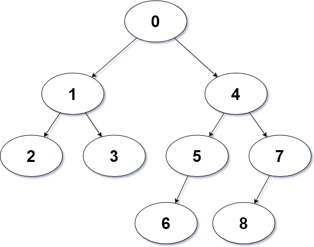

# Distance

A simple implemenation of finding the distance (ie. edges) between nodes in an unsorted binary tree.

Requires [.NET Core 2.2 SDK](https://dotnet.microsoft.com/download) to compile and run

To use the interactive interface run the following commands:
```shell
git clone https://github.com/chiefnoah/distance.git
cd distance
dotnet run
...
```

The predefined tree structure is as follows:

